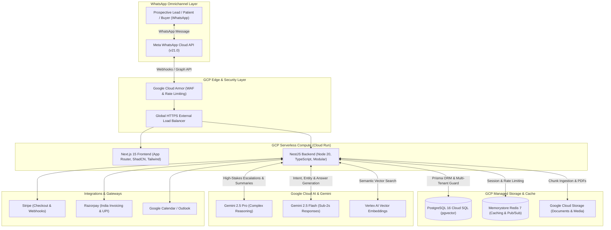
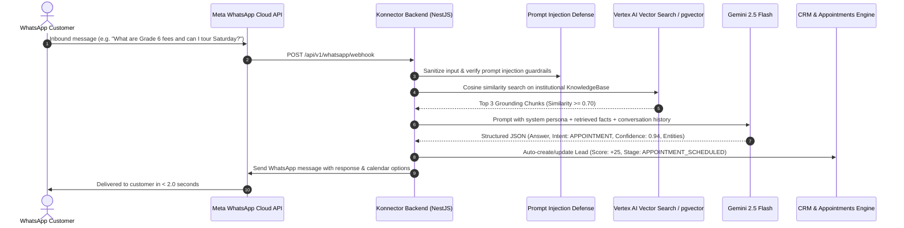

# Konnector AI - System Architecture & Engineering Specifications

> **Tagline:** Your Digital Workforce on WhatsApp  
> **Platform Version:** 1.0.0 Enterprise

---

## 1. Executive Summary

Konnector AI is an enterprise-grade multi-tenant SaaS platform where businesses deploy autonomous **AI Employees on WhatsApp**. Unlike traditional decision-tree chatbots, Konnector AI Employees perform end-to-end business functions:
- **Admissions Officer:** Handles curriculum, tuition, fee schedules, document checklists, and books campus tours.
- **Appointment Coordinator:** Triage patient symptoms, checks doctor availability, enforces fasting instructions, and books clinical consultations.
- **Sales Development Representative (SDR):** Qualifies buyer budget, bedroom configuration, timeline, sends brochures, and schedules VIP site visits.
- **Collections & Customer Support Executives:** Handles invoices, payment links, and Tier-1 issue resolution.

---

## 2. High-Level Architecture Diagram

---

## 3. Multi-Tenant Isolation Architecture

1. **Logical Isolation with Database Foreign Key Constraints:**
   Every single table (`AiEmployee`, `Conversation`, `WhatsAppMessage`, `Lead`, `Appointment`, `KnowledgeBase`, `Subscription`) enforces a mandatory `organizationId` foreign key referencing the master `Organization` entity.
2. **NestJS `TenantGuard` Enforcer:**
   Controllers implement `@UseGuards(TenantGuard)`. If an incoming request attempts to access an entity belonging to another tenant ID, the guard rejects the request with `403 Forbidden`.
3. **Super Admin Impersonation:**
   Super Admins (`Role.SUPER_ADMIN`) can pass an `X-Tenant-Id` header to view and manage specific workspaces while retaining audit logging.

---

## 4. WhatsApp AI Employee RAG Pipeline

---

## 5. Automated Follow-Up Engine State Machine

- **Triggers:** `LEAD_CREATED`, `NO_REPLY_24H`, `APPOINTMENT_MISSED`
- **Execution Delays:**
  - **Day 1 (24h):** Welcome message & campus/brochure video link.
  - **Day 3 (72h):** Value-add inquiry (e.g., student grade, doctor specialty).
  - **Day 7 (168h):** Limited availability or early-bird fee prompt.
  - **Day 14 (336h):** Closing ticket / human staff escalation.
- **Stop Conditions:**
  - If the customer replies at any point on WhatsApp, all active sequence runs for that lead are marked `STOPPED_REPLIED`.
  - If the customer schedules an appointment, sequence status changes to `STOPPED_BOOKED`.

---

## 6. Human Handoff & Dual-Takeover Protocol

When AI confidence drops below the employee threshold (default: 75%) or a customer uses escalation keywords (`talk to human`, `speak to principal`, `doctor urgently`):
1. The conversation status is updated to `HUMAN_TAKEOVER`.
2. A `HandoffTicket` is generated and assigned to available human agents.
3. Automated AI replies are temporarily halted.
4. Gemini generates suggested one-click replies in the live inbox for human agents to review and dispatch.
5. The human agent can click **"Return to AI"** at any time to resume autonomous handling.
