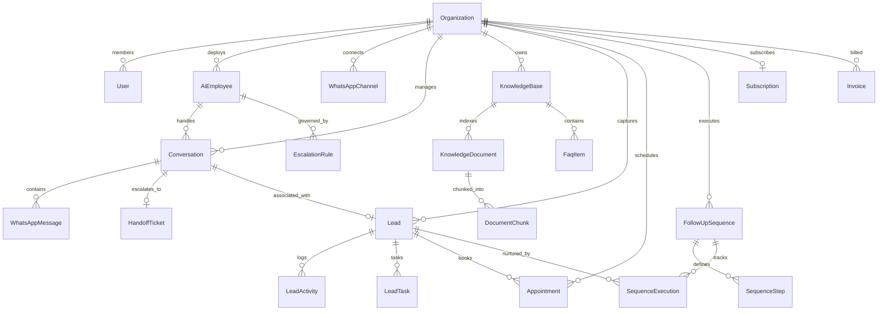

# Konnector AI - Database Schema & Data Dictionary

This document details the PostgreSQL relational database schema for Konnector AI. The schema supports strict multi-tenancy, vector embeddings (via pgvector), role-based access control (RBAC), and automated workflow tracking.

---

## 1. Mermaid Entity-Relationship (ER) Diagram

---

## 2. Core Entities and Data Dictionary

### 2.1 Multi-Tenant Core
- **`organizations`**: Master tenant record. Stores company name, subdomain, white-label branding, status (`ACTIVE`, `SUSPENDED`).
- **`users`**: Tenant accounts. Stores email, hashed password, Firebase UID, and RBAC `Role` (`SUPER_ADMIN`, `PARTNER_ADMIN`, `TENANT_OWNER`, `MANAGER`, `AGENT`, `VIEWER`).
- **`audit_logs`**: Tamper-evident security trail storing IP address, action, entity affected, and user.
- **`usage_meters`**: Monthly usage meter for conversations processed, appointments booked, and AI tokens.

### 2.2 AI Employee Engine
- **`ai_employees`**: Digital employees. Stores name, avatar URL, template type (`ADMISSIONS_OFFICER`, `APPOINTMENT_COORDINATOR`, `SALES_DEVELOPMENT`, `SUPPORT_EXECUTIVE`, `COLLECTIONS_OFFICER`), prompt instructions, personality tone, and confidence threshold (0.0 to 1.0).
- **`escalation_rules`**: Rules triggering human takeover (e.g. low confidence, sentiment drop below 0.3, or trigger keywords).

### 2.3 WhatsApp Omnichannel Layer
- **`whatsapp_channels`**: Linked Meta WhatsApp Business Account (WABA ID, Phone Number ID, display phone number, webhook token, quality rating).
- **`conversations`**: Active WhatsApp threads. Stores contact phone, contact name, status (`ACTIVE_AI`, `HUMAN_TAKEOVER`, `CLOSED`), sentiment score, and AI multi-turn memory.
- **`whatsapp_messages`**: Inbound and outbound message log. Supports text, audio, images, documents, and Gemini-suggested replies.

### 2.4 Knowledge Base & RAG
- **`knowledge_bases`**: Ingestion collections linked to specific AI employees or organizations.
- **`knowledge_documents`**: Stored PDF, DOCX, TXT, or web URLs with processing status.
- **`document_chunks`**: Text windows (800 chars with 100-char overlap) and 768-dimensional vector embeddings for cosine similarity lookups.
- **`faq_items`**: Verified Q&A facts for zero-hallucination grounding.

### 2.5 CRM Leads & Appointments
- **`leads`**: Captured contacts with pipeline `LeadStage` (`NEW`, `CONTACTED`, `QUALIFIED`, `APPOINTMENT_SCHEDULED`, `PROPOSAL_SENT`, `WON`, `LOST`), qualification score (0-100), intent summary, and custom JSON fields.
- **`lead_activities`**: Timeline of all interactions, stage movements, and notes.
- **`appointments`**: Bookings scheduled by AI employees with attendee details, start/end times, and Google Calendar / Outlook links.

### 2.6 Automation, Escalation & Billing
- **`follow_up_sequences`**: Automated multi-day sequences with sequence steps, delay hours, and message templates.
- **`sequence_executions`**: Progress tracker per lead with stop triggers (`STOPPED_REPLIED`, `STOPPED_BOOKED`).
- **`handoff_tickets`**: Escalation tickets created when AI confidence drops or keywords match.
- **`subscriptions`**: Organization subscription state (`TRIAL`, `STARTER`, `GROWTH`, `ENTERPRISE`), billing cycle, Stripe/Razorpay customer IDs.
- **`invoices`**: Tax invoices with 18% GST calculation, PDF receipts, and transaction IDs.
