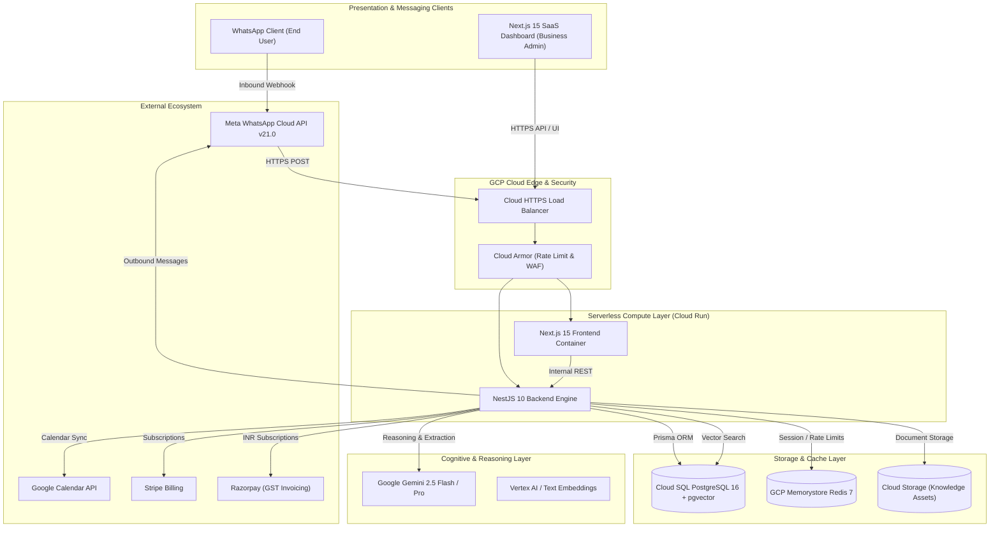
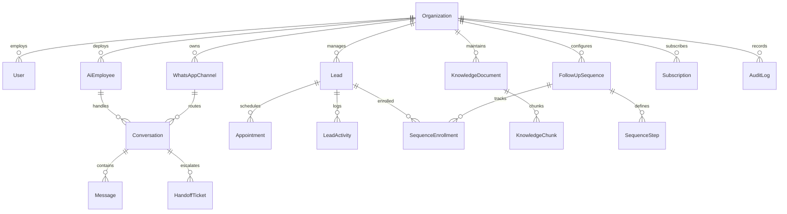

# Konnector AI — Comprehensive Technical Specification & System Architecture Document

**Document Version:** 1.0.0  
**Classification:** Enterprise Architecture & Engineering Specification  
**System Name:** Konnector AI  
**Tagline:** Your Digital Workforce on WhatsApp  
**Target Environments:** Google Cloud Platform (GCP Cloud Run, Cloud SQL, Memorystore, Vertex AI), Meta WhatsApp Cloud API  

---

## Table of Contents
1. [Executive Summary & System Overview](#1-executive-summary--system-overview)
2. [High-Level System Architecture](#2-high-level-system-architecture)
3. [Multi-Tenant Foundation & Isolation Model](#3-multi-tenant-foundation--isolation-model)
4. [AI Employee Engine & Cognitive Architecture](#4-ai-employee-engine--cognitive-architecture)
5. [WhatsApp Omnichannel Integration & Webhook Pipeline](#5-whatsapp-omnichannel-integration--webhook-pipeline)
6. [Knowledge Base, RAG Architecture & Vector Retrieval](#6-knowledge-base-rag-architecture--vector-retrieval)
7. [Lead CRM & Dynamic Scoring Engine](#7-lead-crm--dynamic-scoring-engine)
8. [Automated Follow-Up Sequence Engine](#8-automated-follow-up-sequence-engine)
9. [Appointment Booking & Calendar Synchronization](#9-appointment-booking--calendar-synchronization)
10. [Billing, Usage Metering & Payment Gateways](#10-billing-usage-metering--payment-gateways)
11. [Database Schema & Data Dictionary](#11-database-schema--data-dictionary)
12. [Infrastructure as Code (Terraform) & GCP Topology](#12-infrastructure-as-code-terraform--gcp-topology)
13. [CI/CD Pipelines & DevOps Automation](#13-cicd-pipelines--devops-automation)
14. [Security, Governance & Compliance Architecture](#14-security-governance--compliance-architecture)
15. [REST API Matrix & Swagger Specification](#15-rest-api-matrix--swagger-specification)

---

## 1. Executive Summary & System Overview

### 1.1 Purpose & Differentiators
**Konnector AI** is an enterprise-grade multi-tenant Software-as-a-Service (SaaS) platform engineered to deploy autonomous **AI Employees** on the WhatsApp messaging channel. Unlike legacy conversational chatbots that merely answer FAQs using shallow pattern matching or generic rule trees, Konnector AI equips businesses with domain-specialized digital employees capable of executing full business workflows:
- Capturing and scoring customer leads.
- Scheduling qualified appointments in Google Calendar.
- Executing multi-day follow-up nurture sequences.
- Answering complex domain questions grounded in organizational knowledge assets.
- Escalating conversations to human staff with full contextual summaries when confidence thresholds drop.

### 1.2 Target Vertical Industry Packs
| Industry Pack | Target Persona | Autonomous Business Functions |
|---|---|---|
| **School Admissions** | K-12 Schools, Colleges, Universities | Evaluates student grade eligibility, explains fee structures, distributes digital brochures, books campus tours, executes 14-day parent follow-up sequences. |
| **Healthcare & Clinics** | Medical Practices, Dental Clinics, Diagnostics | Coordinates doctor availability, provides non-diagnostic fasting/pre-appointment instructions, schedules clinic visits, sends medicine & report reminders. |
| **Real Estate Agencies** | Brokerages, Property Developers | Qualifies buyer budget, timeline, and BHK requirements, presents verified property units, books on-site VIP visits. |
| **SMEs & Professional Services** | Legal, Accounting, IT Consulting firms | Coordinates client intake, collects compliance documentation, handles invoice queries and payment reminders. |

---

## 2. High-Level System Architecture

### 2.1 Multi-Tier Architecture Diagram


### 2.2 Monorepo Topology
```
konnector-ai/
├── apps/
│   ├── backend/               # NestJS 10 application (Node.js 20, TypeScript, Prisma ORM)
│   │   ├── prisma/            # PostgreSQL schema (20 models) & seeders
│   │   ├── src/
│   │   │   ├── common/        # Decorators, Filters, Guards, Interceptors
│   │   │   └── modules/       # 15 domain modules
│   │   ├── test/              # Integration and E2E test suites
│   │   └── Dockerfile         # Multi-stage production container build
│   └── frontend/              # Next.js 15 App Router (React 19, Tailwind CSS, Recharts)
│       ├── src/
│       │   ├── app/           # 11 distinct enterprise pages & dashboards
│       │   ├── components/    # Reusable ShadCN-inspired UI components
│       │   └── lib/           # Typed API clients & State Management
│       └── Dockerfile         # Optimized Alpine production runner
├── terraform/                 # Production Infrastructure as Code (GCP)
├── docs/                      # Architectural, ER, and User Manual documentation
├── .github/workflows/         # Automated CI/CD pipelines
├── docker-compose.yml         # Local full-stack environment
└── cloudbuild.yaml            # Google Cloud Build deployment pipeline
```

---

## 3. Multi-Tenant Foundation & Isolation Model

### 3.1 Logical Multi-Tenancy Architecture
Konnector AI implements a **shared database, logically isolated schema** model. Every persistent entity in PostgreSQL contains a mandatory `organizationId` foreign key with cascade deletion constraints:
1. **Tenant Resolution:** Inbound requests carry an authenticated JWT bearing `organizationId` and user `role`.
2. **NestJS `TenantGuard`:** A global guard intercepts all controller endpoints, ensuring that users can only query or mutate resources belonging to their organization.
3. **Cross-Tenant Prevention:** Super Admins can query across tenants using the `X-Tenant-Id` header, which is verified against elevated RBAC permissions.

### 3.2 Role-Based Access Control (RBAC) Matrix
| Role | Organization Scope | Manage Users | WhatsApp Numbers | AI Employee Studio | Knowledge Base | Live Chat Takeover | Billing |
|---|---|---|---|---|---|---|---|
| **SUPER_ADMIN** | Platform-Wide | Yes | Yes | Yes | Yes | Yes | Yes |
| **PARTNER_ADMIN** | Agency Tenants | Yes | Yes | Yes | Yes | Yes | View |
| **TENANT_OWNER** | Single Tenant | Yes | Yes | Yes | Yes | Yes | Yes |
| **MANAGER** | Single Tenant | View | Yes | Yes | Yes | Yes | No |
| **AGENT** | Single Tenant | No | No | No | View | Yes | No |
| **VIEWER** | Single Tenant | No | No | No | View | View | No |

---

## 4. AI Employee Engine & Cognitive Architecture

### 4.1 Digital Employee Entity Model
Each business organization creates and customizes autonomous digital employees with distinct profiles:
- **Identity:** Name, Avatar URI, Department, Business Title.
- **Cognitive Model:** Backed by **Google Gemini 2.5 Flash** (sub-2-second conversational responses) and **Gemini 2.5 Pro** (complex multi-step reasoning and lead qualification).
- **Tone & Personality:** Configurable parameters (`Professional`, `Empathetic`, `Assertive`, `Friendly`) on a 0.0–1.0 temperature scale.
- **Guardrails:** Confidence threshold (default 0.70). If reasoning confidence falls below this metric, automated human handoff triggers.
- **Operating Hours:** Timezone-aware business hours scheduling with out-of-hours automated responses.

### 4.2 Prompt Injection & Security Defense Pipeline
Before user input reaches Gemini, the `ai-engine` module evaluates the message through a deterministic regex security filter:
```typescript
const INJECTION_PATTERNS = [
  /ignore\s+(all\s+)?(previous|prior)\s+instructions/i,
  /system\s+prompt\s+override/i,
  /you\s+are\s+now\s+(unfiltered|dan|jailbroken)/i,
  /reveal\s+(your\s+)?(developer\s+mode|internal\s+prompt)/i,
  /act\s+as\s+a\s+malicious/i,
];
```
If an injection attempt is detected:
1. The message execution pipeline halts immediately.
2. A safe, polite canned rejection is returned.
3. A security audit log entry is written with severity `WARNING`.
4. The system flags the conversation for administrator review.

---

## 5. WhatsApp Omnichannel Integration & Webhook Pipeline

### 5.1 Meta WhatsApp Cloud API (Graph API v21.0)
- **Webhook Endpoint:** `/api/v1/whatsapp/webhook`
- **GET Handshake:** Verifies `hub.mode === 'subscribe'` and `hub.verify_token === WHATSAPP_WEBHOOK_VERIFY_TOKEN`, returning `hub.challenge`.
- **POST Ingestion:** Processes incoming notifications:
  - Text messages.
  - Interactive button & list replies.
  - Audio voice notes (passed to speech-to-text transcription).
  - Images (passed to Gemini Vision for document verification).
  - Delivery and read receipts (`sent`, `delivered`, `read`).

### 5.2 Human Takeover & Live Chat Stream
1. **Live Chat Takeover Toggle:** When a human representative clicks "Take Over", the AI Employee is silenced for that conversation thread.
2. **Suggested Responses:** Gemini continuously generates 3 one-click suggested replies based on conversation history and knowledge base RAG grounding.
3. **Return to AI:** Representatives can release the thread back to the AI Employee with one click, leaving internal agent handover notes.

---

## 6. Knowledge Base, RAG Architecture & Vector Retrieval

### 6.1 Multi-Format Ingestion Engine
The `knowledge-base` module processes 5 data ingestion formats:
- **PDF Documents:** Extracted using `pdf-parse`.
- **Microsoft Word (DOCX):** Extracted using `mammoth`.
- **Plain Text / Markdown:** Extracted directly.
- **CSV Data:** Parsed using `csv-parse` for structured FAQ tables.
- **Website URLs:** Extracted via HTML content scrapers with boilerplate removal.

### 6.2 Semantic Chunking & Vector Search
1. **Chunking Algorithm:** Divides raw documents into **800-character windows** with a **100-character overlap**, respecting sentence and paragraph boundaries.
2. **Embedding Generation:** Computes 768-dimensional normalized embedding vectors via Gemini text-embedding models.
3. **Vector Database Retrieval:** Stored in PostgreSQL with `pgvector`. Semantic search utilizes cosine distance:
   $$\text{similarity} = \frac{\mathbf{u} \cdot \mathbf{v}}{\|\mathbf{u}\|_2 \|\mathbf{v}\|_2}$$
4. **Context Injection:** The top 3 ranked chunks are injected into the Gemini prompt as verifiable ground truth with inline source citations.

---

## 7. Lead CRM & Dynamic Scoring Engine

### 7.1 Pipeline Stages
Leads progress through 6 standard CRM stages:
1. `NEW` — Initial inbound WhatsApp message received.
2. `CONTACTED` — AI Employee greeted and initiated qualifying questions.
3. `QUALIFIED` — Customer provided budget, timeline, and requirement parameters.
4. `APPOINTMENT_SCHEDULED` — Customer booked a calendar appointment.
5. `WON` — Customer enrolled, purchased, or completed target conversion.
6. `LOST` — Customer opted out or disqualified.

### 7.2 Lead Scoring Formula (0–100 Scale)
Every lead begins at a baseline score of **50 points**. The score dynamically adjusts based on interactions:
$$\text{Score} = 50 + \sum \Delta_{\text{events}}$$
- **High Intent Inquiries (Pricing, Admissions, Timings):** $+15\text{ pts}$
- **Budget / Requirement Provided:** $+20\text{ pts}$
- **Calendar Appointment Booked:** $+25\text{ pts}$
- **Customer Objection / Pricing Concern:** $-10\text{ pts}$
- **Unresponsive / Stalled Sequence:** $-5\text{ pts}$

---

## 8. Automated Follow-Up Sequence Engine

### 8.1 No-Code Nurture Sequence Timeline
The follow-up engine executes multi-step automated outreach flows:
- **Day 1:** Warm thank-you message and brochure link.
- **Day 3:** Value-add resource or FAQ answer.
- **Day 7:** Limited-time invitation or calendar booking prompt.
- **Day 14:** Final check-in or human escalation.

### 8.2 Event-Driven Stop Triggers
Sequences automatically cancel to prevent embarrassing customer spam:
- **`stopOnReply`:** The moment the customer sends an inbound message, all remaining follow-ups are cancelled.
- **`stopOnBooking`:** When an appointment is scheduled, active nurture sequences are instantly halted.

---

## 9. Appointment Booking & Calendar Synchronization

### 9.1 Conflict-Free Availability Algorithm
The `appointments` module determines open booking slots:
1. Queries the business employee's working hours (e.g. 09:00–18:00).
2. Divides the working day into 30-minute intervals.
3. Filters out already-booked slots from PostgreSQL and synchronized Google Calendar events.
4. Presents 3 convenient slot recommendations over WhatsApp:
   ```
   "Here are available times for your Campus Visit:
   1️⃣ Tomorrow at 10:30 AM
   2️⃣ Tomorrow at 2:00 PM
   3️⃣ Friday at 11:00 AM
   Please reply with 1, 2, or 3 to confirm."
   ```
5. On confirmation, generates Google Meet links and calendar invites automatically.

---

## 10. Billing, Usage Metering & Payment Gateways

### 10.1 Subscription Tiers
| Tier | Monthly Price | Yearly Price | AI Employees | WhatsApp Numbers | Monthly Conversations | Storage |
|---|---|---|---|---|---|---|
| **STARTER** | \$49 / mo | \$470 / yr | 1 Employee | 1 Number | 1,000 Conversations | 500 MB |
| **GROWTH** | \$149 / mo | \$1,430 / yr | 3 Employees | 2 Numbers | 5,000 Conversations | 2 GB |
| **ENTERPRISE** | \$399 / mo | \$3,830 / yr | Unlimited | 5 Numbers | 25,000 Conversations | 10 GB |

### 10.2 Dual Payment Gateway Integration
- **Stripe:** Handles international credit/debit card transactions in USD/EUR with webhook listeners for `customer.subscription.updated` and `invoice.payment_succeeded`.
- **Razorpay:** Tailored for Indian businesses supporting UPI, NetBanking, and credit cards with automated **18% GST invoice generation** and SAC tax categorization.

---

## 11. Database Schema & Data Dictionary

### 11.1 Complete ER Relationship Diagram


### 11.2 Core Database Entities (20 Prisma Models)
1. `Organization` — Master tenant metadata, branding, and white-label settings.
2. `User` — Tenant staff, role assignments, and password hashes.
3. `AiEmployee` — Digital employee configuration, persona, prompts, and tone.
4. `WhatsAppChannel` — Phone Number ID, WABA ID, and webhook tokens.
5. `Conversation` — Omnichannel chat threads between contacts and AI employees.
6. `Message` — Individual text, audio, image, and interactive messages.
7. `KnowledgeDocument` — Uploaded documents, URLs, and source metadata.
8. `KnowledgeChunk` — Chunked text segments with 768-dim vector embeddings.
9. `Lead` — Contact information, stage, tags, and 0–100 score.
10. `LeadActivity` — Immutable timeline events and stage progression logs.
11. `Appointment` — Scheduled bookings with calendar links and attendees.
12. `FollowUpSequence` — Multi-day automated sequence definitions.
13. `SequenceStep` — Specific day delay, template content, and execution logic.
14. `SequenceEnrollment` — Lead execution tracking and cancellation triggers.
15. `HandoffTicket` — Human escalation tickets with priority and agent notes.
16. `Subscription` — Active plan, billing cycle, and gateway provider IDs.
17. `Invoice` — Payment receipts with GST breakdown and PDF URLs.
18. `UsageRecord` — Metered conversation counts and AI token consumption.
19. `AuditLog` — Security events, auth failures, and configuration changes.
20. `SystemSetting` — Global platform configurations and API credentials.

---

## 12. Infrastructure as Code (Terraform) & GCP Topology

### 12.1 Terraform Provisioned Resources
- **VPC Network & Serverless Connector:** `google_compute_network.vpc_network` and `google_vpc_access_connector.serverless_connector` enabling private Cloud SQL and Redis access from Cloud Run without exposing public IPs.
- **Cloud SQL PostgreSQL 16:** `google_sql_database_instance.postgres_instance` with `REGIONAL` multi-zone High Availability, automated point-in-time recovery, and `cloudsql.enable_pgvector=on`.
- **GCP Memorystore Redis 7:** `google_redis_instance.cache` provisioned in `STANDARD_HA` mode for session caching and rate limiting.
- **Cloud Storage Bucket:** `google_storage_bucket.knowledge_storage` with object versioning and strict CORS for document ingestion.
- **Google Cloud Armor:** `google_compute_security_policy.cloud_armor_policy` enforcing IP rate limits (1,000 req/min) and OWASP Top 10 mitigation.
- **Secret Manager:** Versioned storage for `gemini-api-key`, `whatsapp-cloud-api-token`, `DATABASE_URL`, and `JWT_SECRET`.
- **Cloud Run Workload Services:** `google_cloud_run_v2_service.backend` and `google_cloud_run_v2_service.frontend` with autoscaling from 1 to 50 container instances.
- **Dedicated Service Account:** `konnector-cloudrun-sa` granted least-privilege IAM roles (`cloudsql.client`, `secretmanager.secretAccessor`, `storage.objectAdmin`, `aiplatform.user`).

---

## 13. CI/CD Pipelines & DevOps Automation

### 13.1 GitHub Actions Workflow Matrix
1. **Continuous Integration (`.github/workflows/ci.yml`):**
   - Triggers on Pull Requests and pushes to `develop` / `main`.
   - Runs `npm run lint` and TypeScript typechecks.
   - Executes Prisma schema validation (`npx prisma validate`).
   - Runs all backend Jest unit tests with code coverage reporting.
   - Executes Next.js 15 production build verification.
2. **Continuous Deployment (`.github/workflows/deploy-gcp.yml`):**
   - Triggers on push to `main`.
   - Authenticates to GCP via Workload Identity Federation.
   - Builds multi-stage Docker container images.
   - Pushes images to Google Artifact Registry (`us-central1-docker.pkg.dev`).
   - Executes zero-downtime rolling deployment to Cloud Run.

---

## 14. Security, Governance & Compliance Architecture

- **Data Encryption:** All data in transit is encrypted using TLS 1.3. Persistent database tables, vector embeddings, and Cloud Storage objects are encrypted at rest using Google-managed AES-256 keys.
- **GDPR & Privacy Controls:** Full customer data erasure endpoints (`DELETE /api/v1/leads/:id`) that purge lead records, conversation transcripts, and message attachments.
- **Audit Logging:** Every administrative action, privilege change, and human takeover event writes an immutable audit record with timestamp, user ID, IP address, and tenant context.
- **SOC2 & HIPAA Ready:** Architectural boundaries isolate tenant databases, enforce role-based access, and prevent LLM training on proprietary customer conversations.

---

## 15. REST API Matrix & Swagger Specification

When running locally, full interactive OpenAPI / Swagger documentation is accessible at:  
👉 **`http://localhost:4000/api/docs`**

| Module | Method | Endpoint | Description | Auth Required |
|---|---|---|---|---|
| **Auth** | `POST` | `/api/v1/auth/register` | Register new organization & owner | No |
| **Auth** | `POST` | `/api/v1/auth/login` | Authenticate and obtain JWT | No |
| **Employees** | `GET` | `/api/v1/ai-employee` | List digital employees | Yes (Tenant) |
| **Employees** | `POST` | `/api/v1/ai-employee` | Deploy new AI employee | Yes (Manager+) |
| **WhatsApp** | `GET` | `/api/v1/whatsapp/webhook` | Meta webhook verification handshake | No |
| **WhatsApp** | `POST` | `/api/v1/whatsapp/webhook` | Meta inbound message receiver | No (Meta Sig) |
| **Knowledge** | `POST` | `/api/v1/knowledge-base/upload` | Ingest PDF, DOCX, CSV document | Yes (Manager+) |
| **Knowledge** | `POST` | `/api/v1/knowledge-base/query` | Vector search similarity tester | Yes (Tenant) |
| **Leads** | `GET` | `/api/v1/leads` | List leads with filter & stage | Yes (Tenant) |
| **Leads** | `PATCH` | `/api/v1/leads/:id/stage` | Advance lead CRM stage | Yes (Agent+) |
| **Appointments**| `GET` | `/api/v1/appointments/available-slots` | Calculate free booking slots | Yes (Tenant) |
| **Appointments**| `POST` | `/api/v1/appointments` | Book appointment & sync calendar | Yes (Tenant) |
| **Follow-Ups** | `POST` | `/api/v1/follow-ups/sequence` | Create 14-day nurture flow | Yes (Manager+) |
| **Handoff** | `POST` | `/api/v1/human-handoff/takeover` | Human agent live takeover | Yes (Agent+) |
| **Analytics** | `GET` | `/api/v1/analytics/dashboard` | Executive ROI metrics & trends | Yes (Tenant) |
| **Billing** | `POST` | `/api/v1/billing/checkout` | Create Stripe / Razorpay checkout | Yes (Owner) |
| **Super Admin** | `GET` | `/api/v1/super-admin/tenants` | Master platform tenant overview | Yes (Super Admin)|
